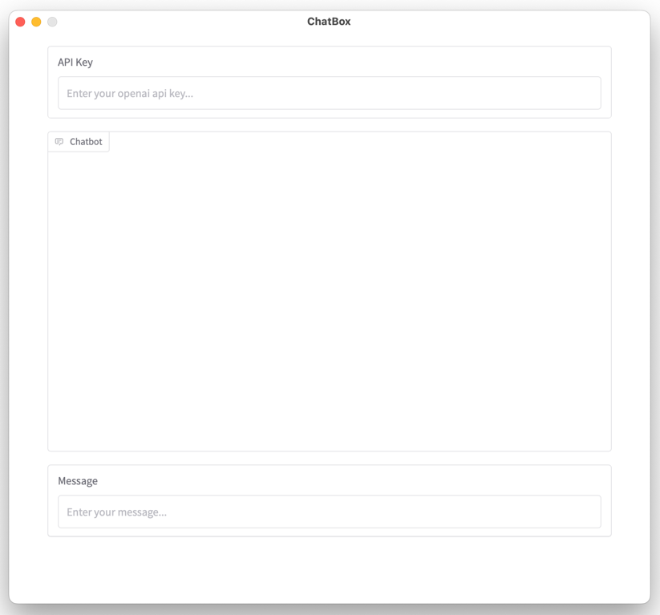

# ChatBox

[](https://github.com/rayyildiz/chatbox/actions/workflows/build.yaml)
[](https://github.com/rayyildiz/chatbox/actions/workflows/publish.yaml)
[](https://github.com/rayyildiz/chatbox/actions/workflows/github-code-scanning/codeql)




A simple desktop application that provides a user-friendly interface for interacting with OpenAI's chat models like GPT-4o. ChatBox wraps the OpenAI API in a clean, native desktop window for a seamless chat experience.

## Features

- Clean, desktop-native interface for ChatGPT interactions
- Streaming responses for real-time feedback
- Chat history maintained during session
- Configurable OpenAI model selection
- Custom API endpoint support
- Secure API key storage

## Requirements

- Python 3.12 or higher
- OpenAI API key

## Installation

### Pre-built Executables

The easiest way to get started is to download a pre-built executable from the [GitHub Releases](https://github.com/rayyildiz/chatbox/releases) page. Executables are available for:

- Windows
- macOS (ARM)
- Linux

### From Source

1. Clone the repository:
   ```
   git clone https://github.com/rayyildiz/chatbox.git
   cd chatbox
   ```

2. Install dependencies:

   Using [uv](https://docs.astral.sh/uv/) (recommended):

   ```
   uv pip install -e .
   ```

3. Run the application:

   ```
   python src/app.py
   ```

### Building a Standalone Executable

You can build a standalone executable using PyInstaller:

```
python installer.py
```

Or using the Makefile (note that using installer.py directly is recommended as it contains the most up-to-date build configuration):

```
make installer
```

The executable will be created in the `dist` directory.

## Usage

1. Launch the application
2. Enter your OpenAI API key in the designated field
3. Type your message in the input box and press Enter

## Configuration

The application can be configured using environment variables:

- `OPENAI_API_KEY`: Your OpenAI API key (can also be entered in the UI)
- `OPENAI_BASE_URL`: Custom API endpoint (default: https://api.openai.com/v1)
- `OPENAI_MODEL`: The model to use (default: gpt-4o-mini)

You can set these variables in a `.env` file in the project root.

## Dependencies

- gradio: For creating the chat interface
- openai: For interacting with OpenAI's API
- pywebview: For creating the desktop window
- environs: For environment variable handling
- cffi: For C Foreign Function Interface

## Development

To set up the development environment:

```
uv pip install -e ".[dev]"
```

This will install additional development dependencies:
- pyinstaller: For building standalone executables
- ruff: For code linting and formatting

## License

[MIT License](LICENSE)
